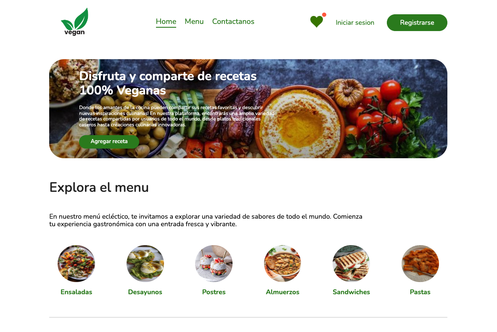
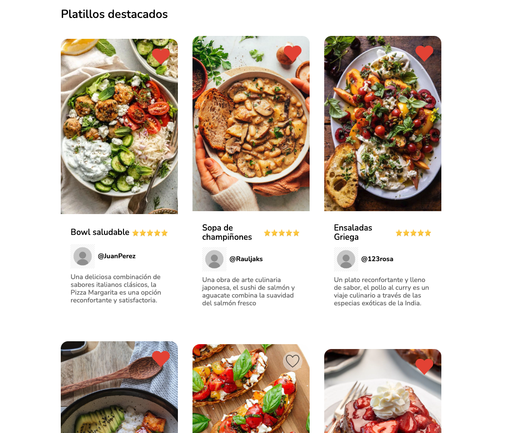
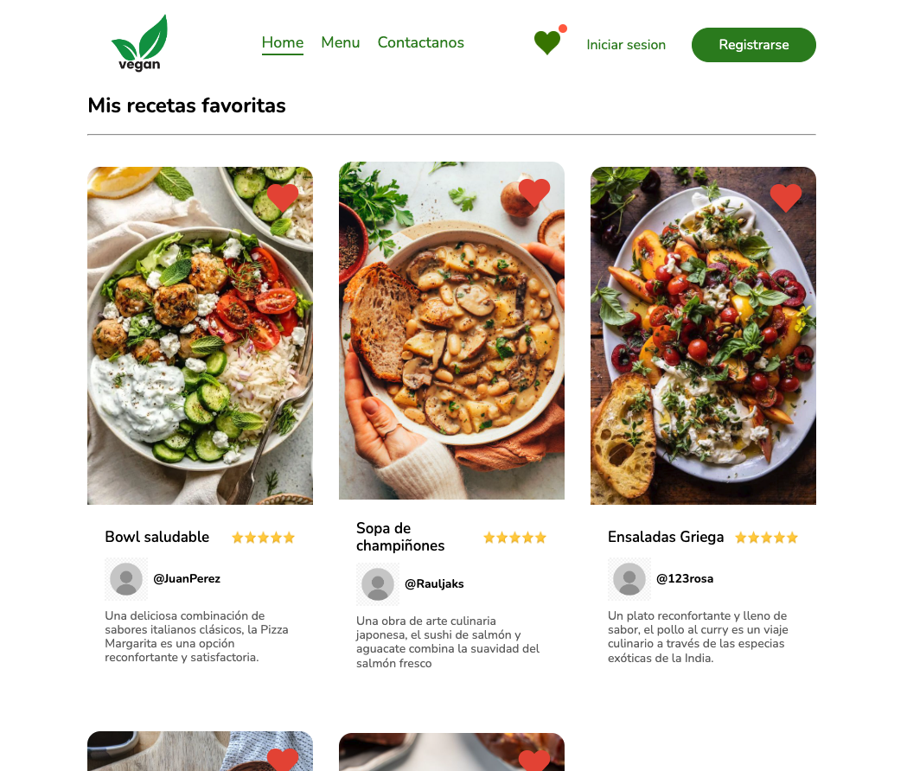
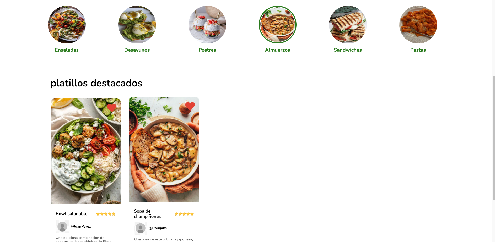
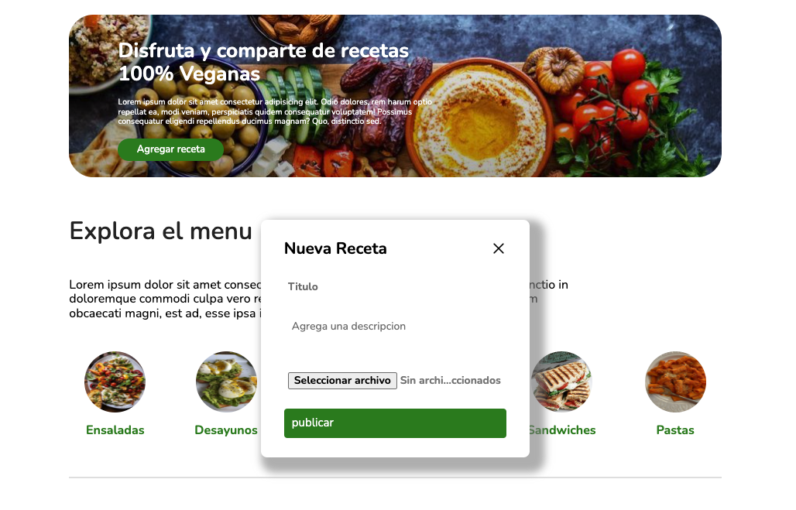
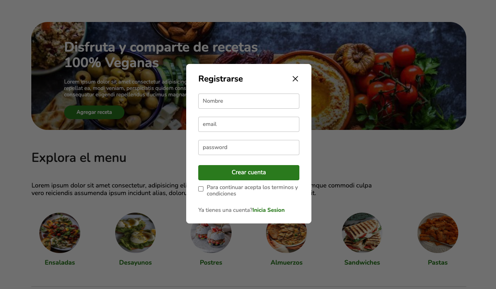

# Vegan Social Network

Proyecto red social desarrollado con React y estilado con css puro, donde puedes explorar diferentes recetas, guardar tus favoritas, filtrarlas, y agregar tus propios platillos. 

## Deploy
***
Puedes ver una demostración del proyecto desplegado [aquí](https://vegan-sigma.vercel.app/).
***

***

***

***

***

***
